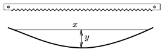

The blade of a simple hacksaw is usually about 3 cm long and at its ends there are small holes. Connect the two ends of the blade with pieces of strong strings of different lengths. How does the bending of the blade ( y ) depend on the distance between the holes x ? Measure how does the tension in the string depends on the distance  x .

 (6 pont)

