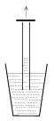

Close the top end of a glass tube, open at its both ends, and push it vertically into a bucket of water. Suddenly open the top end of the tube. Examine how the height of the first highest water level depends on the length of that part of the tube which is immersed into the water. Use several tubes of different diameters.

 (6 pont)

