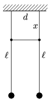

Make a connection between two simple pendulums of the same lengths, with a wooden skewer, which is attached to the threads. Displace one of the pendulums in the plane determined by the two pendulums and measure how long it takes for this pendulum to stop and for the other to swing with the greatest amplitude. How does this time depends on the distance denoted by x shown in the figure?

 (6 pont)

