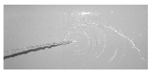

A beam of water, which hits a vertical plane surface perpendicularly, spreads out such that it has a parabolic boundary. (E.g. water coming from the shower hitting the side of the bathtub.) Measure how the focal length of this parabola depends on the speed of the water.

 (6 pont)

