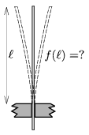

Fix a piece of thin flexible steel sheet (for example the blade of a knife or a saw) into a vise, such that at most 10 cm long part of it sticks out of the jaws of the vise. The end of the blade which sticks out can be round or pointed, it is not necessary to use a rectangular blade. Pluck the part of the blade which sticks out. Measure how the frequency  f of the plucked blade (the pitch of the emitted sound) depends on the length of the midline of the oscillating part of the blade.

 (6 pont)

