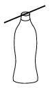

Mount an axle to the cap of a half-litre PET-bottle, and measure the period of the swinging bottle about this axle. Vary the amount of liquid in the bottle and determine the amount of liquid in the bottle for which the period is the greatest.

 (6 pont)

