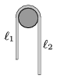

A horizontal towel rail can hold the towel even if the two parts of the towel hanging on the two sides of the rail are different (see the figure ). Measure how the ratio of $_{1}$/ $_{2}$, when the towel is just about to slip on the rail, depends on the wetness of the towel (the amount of soaked up water).

 (6 pont)

