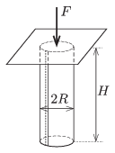

Paper tubes are made from A4 sheets of paper, such that the shorter sides of the paper are glued together (overlapping approximately a 1 cm wide stripe). Placing the tubes to a horizontal tabletop and applying a load along its symmetry axis, examine at which load will the tubes collapse. How does the critical load depend on the height of the tube?

 (6 pont)

