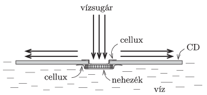

Stick a coin (or several coins) with a piece of cello-tape onto the hole at the middle of a damaged or not used CD disc. (Put cello-tape to the other side of the hole as well in order to make the rim of the small hole smooth.) Carefully place the disc onto the surface of water in a dish - such that the coin is at the bottom of the disc - and from a certain height pour water onto the hole of the disc. The water beam should be narrow and vertical. If the water beam is strong enough (but not too strong) then the CD disc does not sink when it is released.

 Measure how the minimum amount of water needed for the floating of the disc depends on the total mass of the disc-coin system.
 (6 pont)

