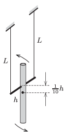

Attach a spindle perpendicularly to a (preferably uniform density) rod of length $h$ at a distance of $\frac{1}{10}h$ from the centre of the rod. Hang the spindle horizontally with threads of lengths $L$ (bifilar suspension), then make the rod swing perpendicularly to the plane determined by the threads (as shown in the figure ).

 Investigate how the two types of swinging motions (the wobbling of the rod and the waggling of the spindle) couple. Choose different thread lengths, and determine that ratio of $L/h$ at which the period of the alternation between the two types of oscillation is the longest.
 (6 pont)

