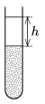

Fill one-fourth of a test tube with powdered chalk, and then pour water onto it such that the test tube is nearly filled. Shake well, and then let the chalk powder settle.

 Measure how the height of the cleared water $h$ depends on the time elapsed from the beginning of the settling process.
 (6 pont)

