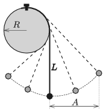

One end of a thin, flexible and not stretchable thread is attached to the topmost point on the rim of a cylinder of radius $R$. The cylinder is fixed and it has a horizontal axis. A small object is attached to the other end of the thread. In the equilibrium position the vertical part of the thread has a length of $L=3R$. The object is displaced, as shown in the figure, and then it is released. The period of the motion – for a relatively large initial displacement – of the object depends on the ''amplitude'' $A$. Measure for several different values of $A$ by what percent the period of this pendulum $T(A)$ differs from the period $T_0=2\pi\sqrt{{L}/{g}}$ of a simple pendulum of length $L$?

 (6 pont)

