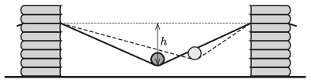

Make an approximately 80 cm long paper strip, and fix its ends at the same height to some moveable stands. Place a small cylinder-shaped tin can on the middle of the strip such that the tin pulls down the strip a little. Then displace the tin always by the same amount (approximately 20 cm), and then release it without any initial speed, and let it roll freely. Measure the period of the (damped) periodic motion of the tin, as a function of the sag of the strip $h$ in the case of
 $a)$ a full tin can;
 $b)$ an empty tin can.

 (6 pont)

