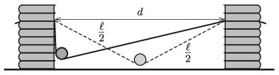

Make an 80-cm long paper strip from a thin sheet of paper, and attach its ends at the same height to two movable stands, which are at a certain distance from each other. Place a small size cylinder-shaped unopened tin can on the strip as shown in the figure, and let it roll without initial speed. In the case of different distances of $d$ between the stands measure the greatest speed of the symmetry axis of the can. At what distance of $d$ will this speed be the maximum?

 (6 pont)

