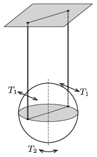

Measure the period ($T_1$) of a thin-walled ball, which is suspended as shown in the figure and is displaced a little perpendicularly to the plane of the threads. Then turn a bit the initially stationary ball, about its vertical axis and measure the period of the torsional vibration ($T_2$). From the measured value calculate the ratio of $\frac{T_1}{T_2}$.

 (6 pont)

