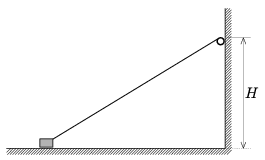

A small engine, fixed to a vertical wall at a height of H , winds up a piece of thread with a constant speed of v $_{0}$. At the other end of the thread there is a small body which moves along the horizontal ground (friction is not negligible). How far is the small body from the wall when it rises from the ground? Data: H =20 cm, v $_{0}$=5 cm/s.

 (5 pont)

