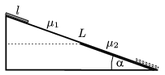

The angle of elevation of an inclined plane of length L is . The coefficient of friction on the top half of the plane is $_{1}$ and on the bottom part $_{2}$. At the top of the plane a plate of length l < L /2 is released. (The contact between the surface of the plate and the slope is uniform.) Under what conditions does the plate stop exactly when the front of the plate reaches the bottom of the slope.

 (5 pont)

