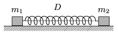

Two small bodies of masses m $_{1}$, and m $_{2}$ are attached to the two ends of an ideal spring of spring constant  D . The spring is stretched by l , and then the two bodies are released at the same time. Find the greatest speeds of the two masses, the amplitudes of their oscillations, and the frequencies. Friction is negligible. ( Data: m $_{1}$=1 kg, m $_{2}$=2 kg, D =100 N/m, l =9 cm.)

 (4 pont)

