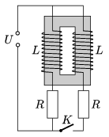

Two coils are placed to the same closed iron core. The number of turns of the two coils are equal, and the sense of their winding is a ) the same, b ) opposite. The switch, which has been closed for a long time, is suddenly opened. Find the current in the different branches right after turning off the switch (see figure ).

 (5 pont)

