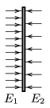

A charged metal sheet is placed into uniform electric field, perpendicularly to the electric field lines. After placing the sheet into the field, the electric field on the left side of the sheet will be E $_{1}$=5.6$^{.}$10$^{5}$ V/m and on the right it will be E $_{2}$=3.1$^{.}$10$^{5}$ V/m (see the figure ).

 a ) Find the total charge of the sheet if you know that a force of 0.08 N is exerted on it.
 b ) Find the area of the sheet.
 (5 pont)

