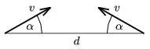

The figure shows two protons which start to move at the same moment with an initial speed of v . Find the smallest distance between the two protons. Data: v =10$^{6}$ m/s, d =10$^{-9}$ m, =30$^\circ$.

 (4 pont)

