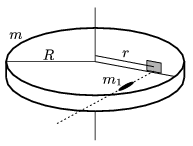

A horizontal disc of mass m =0,6 kg and radius R =10 cm can be rotated easily about a vertical axle. Along a radius of the disc a sheet is fixed to the disc. (The mass of the sheet is negligible.) A horizontally fired bullet, whose mass is m $_{1}$=20 g, hits the sheet perpendicularly, and the disc begins to rotate at an angular velocity of =20 s$^{-1}$. The distance between the axle and the place of impact is r =8 cm. What was the initial speed of the bullet, if a ) it is embedded in the sheet; b ) it bounced back totally elastically?

 (5 pont)

