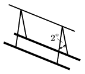

Two long straight wires are hanged by 1.2-m long insulating threads as shown in the figure. A 1-m long piece of both wires has the mass of 20 g. The currents have the same magnitude in the wires. Find the current in the wires if the angle between the threads is 2$^\circ$. What is the direction of the currents?

 (4 pont)

