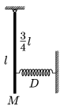

A beam of mass M and of length l is attached to a pivot hinge where the friction is negligible as shown in the figure. At 3 of the beam a spring is attached to it and its other end is connected to the wall. (The spring has a spring constant D and it can both pull an push.) Find the period of the beam for small displacements.

 (5 pont)

