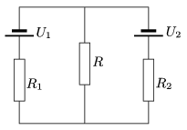

Two voltage supplies are connected parallel to the same resistor. The electromotive force of one of them is U $_{1}$, and its internal resistance is R $_{1}$. The emf of the other is U $_{2}$, and its internal resistance is R $_{2}$. What is the resistance R of the resistor if it is to dissipate the greatest power?

 (4 pont)

