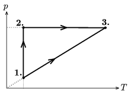

A diatomic ideal gas is taken through the cyclic process shown in the figure. In state 1 the pressure of the gas is 100 kPa and its temperature is 350 K. In state 2 the pressure is 300 kPa. What is the efficiency of the cycle?

 (5 pont)

