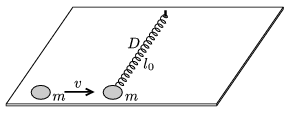

A spiral spring of negligible mass and spring constant D lies un-stretched on a smooth horizontal plane. Its length is l $_{0}$, and one of its end is fixed to a vertical axle, while the to other a point-like disc of mass m is attached. Another disc of mass m collides elastically with the disc attached to the spring. The initial velocity of the moving disc is v and is perpendicular to the axis of the spring. Find the smallest radius of curvature of the path of the disc attached to the spring. Data: D =64 N/m, l $_{0}$=1 m, m =0.5 kg, v =8 m/s.

 (5 pont)

