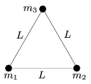

There are three small discs of masses m $_{1}$=0.2 kg, m $_{2}$=0.3 kg, m $_{3}$=0.52 kg on a horizontal air-cushioned table, and they are tied with thin massless threads of length L =60 cm, as shown in the figure. a ) Find the distances between any of the discs and the centre of mass of the system. b ) The system is made to rotate about the centre of mass at a constant angular speed of =10 s$^{-1}$. Calculate the tensions in the threads.

 (5 pont)

