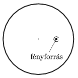

There is a point-like light-source in a metal sphere whose surface reflects light. The light-source is at the midpoint of a radius of the sphere. After two reflections where will be the image of the light-source if it is shaded as shown in the figure. Where will be the image if the shading-cap is rotated by 180$^\circ$? Draw a figure of the special rays too.

 (4 pont)

