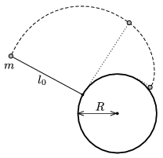

A vertical cylinder of radius R is fixed on a horizontal, ideally smooth tabletop. There is a string attached to the bottom of the cylinder, while to the other end of the string a small disc, whose mass is m , is fixed. The small disc is given a velocity v $_{0}$ which is perpendicular to the tightened string. The disc slides on the tabletop while the string is wound round the cylinder. a ) What is the velocity of the small disc when it hits the wall of the cylinder? (Give both the direction and the magnitude.) b ) What is the tension at this moment? ( Data: R =1 m, l $_{0}$=2 m, r =2 cm, m =5 g.)

 (5 pont)

