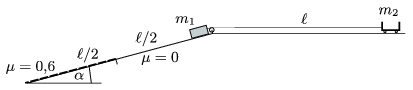

A body of mass m $_{1}$=2 kg slides down from the top of an inclined plane (the angle of inclination is =20$^\circ$.) A cart of mass m $_{2}$=1 kg is attached to this body with a thread of length =1.6 m as shown in the figure. The thread initially is straight. Along the first part of the slope, the length of which is /2, friction is negligible, along the second part, the length of which is /2, the coefficient of friction is =0.6. How far will the two objects be when the cart reaches the pulley?

 (4 pont)

