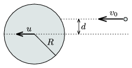

A disc of radius R is moved with a constant u velocity on an air-cushioned table. Another small disc collides with it elastically with a speed of v $_{0}$=0.3 m/s, the velocities of the discs are parallel. The distance d shown in the figure is equal to R /2, friction between the discs is negligible.
 a ) For which u will the small disc move perpendicularly to its original motion after the collision?
 b ) What will be the speed of the small disc in this case?

 (5 pont)

