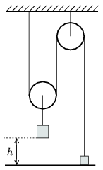

The mass of the body which is hanging on the rope attached to the movable pulley is four times as much as the mass of the body which is fixed to the ground. At a given instant the fixed body is released. To what height does it ascend? (The mass of the pulleys and the ropes is negligible.)

 (4 pont)

