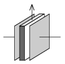

A parallel plate condenser of charge Q consists of two vertical square-shaped plates of sides  a , which are at a distance of  d . Between the plates, parallel to them, there is another square-shaped metal plate which has the same size as the plates of the condenser and its width is d /3. Find the work done while this plate of density is pulled out of the plates.

 (5 pont)

