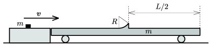

A small body of negligible size slides with a speed of v onto a long cart, which can move easily. The mass of the small body and the cart are the same. In the middle of the cart there is a slope which has a shape of a circular arc of central angle of 45$^\circ$ and of radius R . The small body slides along the slope and then it falls exactly to the end of the cart. What is the length of the cart? (Friction is negligible.)
 Data: v =5 m/s, R =0.4 m.

 (5 pont)

