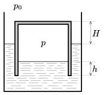

In modern wastewater treatment plants water is thickened first to gain biomass which is rich in organic materials. With the help of bacteria, biogas is produced, and biogas is held in liquid sealed containers. (The container is similar to an upside-down glass which is placed to water.) If the amount of gas is increasing, then the container ascends, if the amount of gas is decreasing then it descends. The gas cannot escape because of the liquid at the bottom of the tank. For safety reasons the height of the liquid h must be at least 1 metre, and the top of the tank can be maximum H =6.5 metres above the the level of the water outside.
 60% of the produced gas is metan, and 40% is carbon-dioxide. The volume of the empty cylinder shaped container is 2000 m$^{3}$, the gauge pressure of the confined gas is 50 mbar, and the maximum temperature of the gas in a hot summer day can be 60 $^\circ$C.
 a ) Find the mass of the moving part in tons.
 b ) How many cubic metre gas can be put to the container at a pressure of p =1.013 bar and at a temperature of 20 $^\circ$C?
 c ) How much heat is released if the total amount of gas is burned?
 The average external pressure is p $_{0}$=1.013$^{.}$10$^{5}$ Pa.

 (5 pont)

