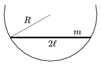

A thin uniform rod of length 2 and of mass m can move along a vertical circle of radius R without friction. Determine the frequency of the small amplitude oscillatory motion of the rod about the equilibrium position.

 (5 pont)

