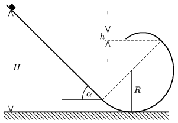

The figure shows a smooth vertical path. On the left-handside there is a ramp, the incline angle is =45$^\circ$, than it is continued with a semi-circle of radius  R , and then there is a parabola at the end. The symmetry axis of the parabola is vertical, and the parabola is open above. If a body travel through the path without friction, the normal force exerted on it does not change abruptly at the border of the semicircle and the parabola.
 a ) What is the height h of the parabola?
 b ) What is the least height  H , measured from the ground, at which an object should be released in order to go through the whole path?

 (5 pont)

