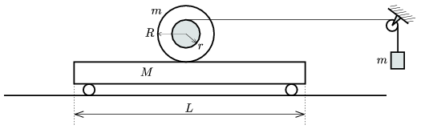

The figure shows a disc and a trolley. The mass of the disc is m =5 kg, its radius is R =0.2 m, the mass of the trolley is M =8 kg, and its length is L =1 m. The trolley can move easily, and the disc does not slide on the trolley. The string which rolls down from the massless pulley attached to the disc is horizontal and the mass of the weight attached to its other end is also m . How long does it take for the disc to roll down from the trolley if it was released from rest at the middle of the trolley. The radius of the pulley is r = R /2? How much distance does the weight descend?

 (5 pont)

