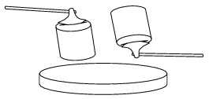

An axe is wedged in a piece of wood. In which case will the wood be split more easily: if the support is hit
 X ) by the poll (butt) of the axe, or
 Y ) by the piece of wood?
 a ) It does not matter by which of the above the support is hit.
 b ) The support is to be hit by that one which has the smaller mass.
 c ) The support is to be hit by the piece of wood, because in this case the piece of wood stops, and the axe will penetrate into the wood even more deeply, due to its inertia.
 d ) In case Y because the axe is made of iron thus its mass is greater.

 (3 pont)

