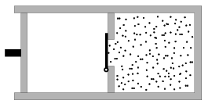

A wall divides the cylindrical, thermally insulated container of volume 20 litres into two parts as shown in the figure. There is vacuum in the left part which is closed by a thermally insulated fixed piston, and in the other part there is Nitrogen gas at a pressure of p =5$^{.}$10$^{5}$ and at a temperature of 300 K. (The external pressure is 10$^{5}$ Pa.) The door on the wall opens because of the excess pressure, and the gas expands immediately. Then the fixing of the piston is ceased, and the gas is pushed back into its original place.
 a ) How much work was performed during the compression of the gas?
 b ) What are the temperature and the pressure of the gas at the end of the process?

 (5 pont)

