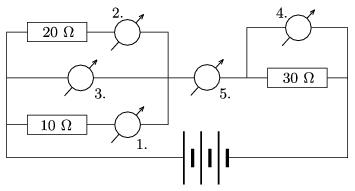

The third meter shown in the figure reads 6 V. What do the other meters measure and what are their readings? What is the voltage across the power supply? (The meters can be considered ideal ones.)

 (3 pont)

