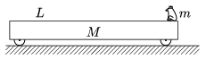

An easily moveable trolley of mass M and of length L is at rest on the horizontal tabletop. At the end of the trolley there is a frog of mass m . What must the initial speed of the frog be at which it has to leap in the direction of measured from the horizontal in order to land exactly at the other end of the trolley? (Data: M =0.6 kg, m =54 g, L =81 cm, =45$^\circ$.)

 (5 pont)

