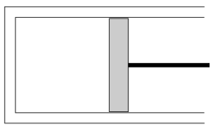

The horizontal cylinder shown in the figure and the piston in it, which can move without friction, are adiabatically insulated. The mass of the piston is 10 kg, the area of its cross-section is 50 cm$^{2}$. The temperature of the air confined in the cylinder is 27 $^\circ$C, its initial pressure is equal to the atmospheric pressure. The cylinder is slowly turned into the vertical position. By what value does its temperature change?

 (5 pont)

