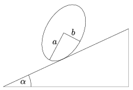

What is the greatest angle of elevation of a slope onto which a cylinder which has an elliptical cross section can be placed, such that it stays at rest, provided that friction is big enough? The semi-major axis of the ellipse is a and its semi-minor axis is  b .

 (5 pont)

