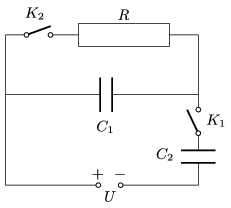

The capacitors arranged as shown in the figure are all neutral. At a certain instant switch K $_{1}$ is closed.

 a ) Find the voltage across each capacitors after switch K $_{1}$ is closed.
 b ) After a short time switch K $_{2}$ is closed as well. Determine the energy of the condensers.
 c ) How much heat was generated in the system after closing switch K $_{2}$?
 (5 pont)

