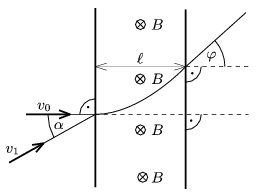

The width of the uniform magnetic field, shown in the figure, is =5 cm, the induction of the field is B =0.167 T. A proton enters into the field perpendicularly to the field lines, and after passing the magnetic field it is deflected by an angle of =30$^\circ$.
 a ) Determine the speed v $_{0}$ of the proton and the time while it passes the magnetic field.
 b ) What voltage is to be applied in order to stop the proton in a distance of s =10 cm, and how long does it take to stop the proton?
 c ) Suppose that another proton enters into the magnetic field at a speed of v $_{1}$=2$^{.}$10$^{6}$ m/s, and at the angle , shown in the figure. What is the least angle  , if the particle bounces back from the magnetic wall?

 (5 pont)

