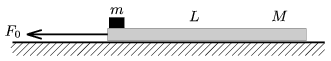

A small block of mass m =1 kg is placed to a plank which moves on a horizontal frictionless surface, as shown in the figure. The mass of the plank is M =4 kg, and its length is L =0.8 m. The coefficient of friction between the plank and the block is =0.4.
 a ) What is the least constant force F $_{0}$ with which the plank must be pulled in order to make the block slide down from it?
 b ) How long does it take for the bock to slide down if the pulling force is F $_{1}$=3 mg?
 c ) Till the instant when the block fell off the plank what percent of the force F $_{1}$ increased the internal energy of the system?

 (4 pont)

