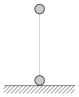

Two tennis balls of mass 60 g are attached with a massless rubber thread, and held in the vertical position as shown in the figure. In this position the unstretched length of the rubber thread is 40 cm. The upper ball is slowly raised vertically upward, until the lower ball just becomes unsupported by the ground. At this time the length of the thread is 1 m. The rubber thread exerts a force which is proportional to its extension.
 a ) How much work is done while the upper ball was raised?
 b ) Releasing the upper ball at what speed will it hit the lower one?
 c ) How much time elapses between the release of the upper ball and the collision?

 (5 pont)

