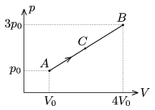

A sample of Helium gas is taken through the process A B , shown in the figure, p $_{0}$=10$^{5}$ Pa, V $_{0}$=3 dm$^{3}$. Determine the pressure and the volume of the gas at state  C , until which Q $_{ AC }$=3700 J heat is added to the gas.

 (5 pont)

